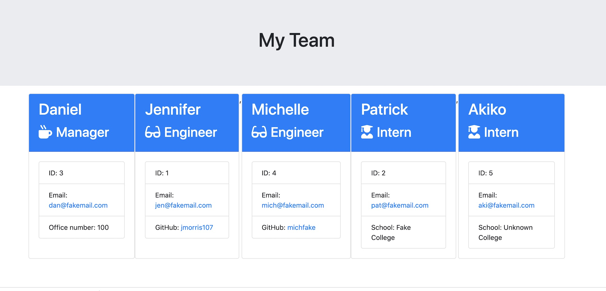

# Team Generator using Node.js💡
  
  
  
  
  

  
  
  
  
  
  
  
  
  # Description
  📝 This is a team generator command line application. The application will prompt the user for information about the team manager and then information about the team members.

<a href="https://youtu.be/KDYLwKzrlbc" rel="nofollow"><g-emoji class="g-emoji" alias="video_camera" fallback-src="https://github.githubassets.com/images/icons/emoji/unicode/1f4f9.png">📹</g-emoji>Full video for the functional demonstration of the application is here.</a>

   

  ## Table of Contents
  - [Description](#description)
  - [Installation](#installation)
  - [Usage](#usage)
  - [License](#license)
  - [Contribution](#contribution)
  - [Test](#test)
  - [Questions](#questions)

 # Acceptance Criteria
1. Functional application.
2. GitHub repository with a unique name and a README describing the project.
3. User can use the CLI to generate an HTML page that displays information about      their team.

4. All tests must pass.

  # Installation
  🗳 <code>Node.js</code><code>npm install inquirer</code>
  # Usage
  💻 Run node app.js on Terminal(Mac) or Gitbash(Windows) and answer the prompt questions. <code>node app.js</code>
  
  # Contribution
  👩🏻‍💻 <a href="https://github.com/jmorris107">Jennifer Morris</a>
  
  # Test
  🧩
1. Run tests
2. Create or update classes to pass a single test case
3. Repeat

🎗 Remember, you can run the tests at any time with <code>npm run test</code>
  
  # License
  🚀
  None

  # Questions❓
  :octocat: My GitHub link: [jmorris107](https://github.com/) 
   
   📩 If you have any question, email me here: jenniferinbaranoseidou@gmail.com  
